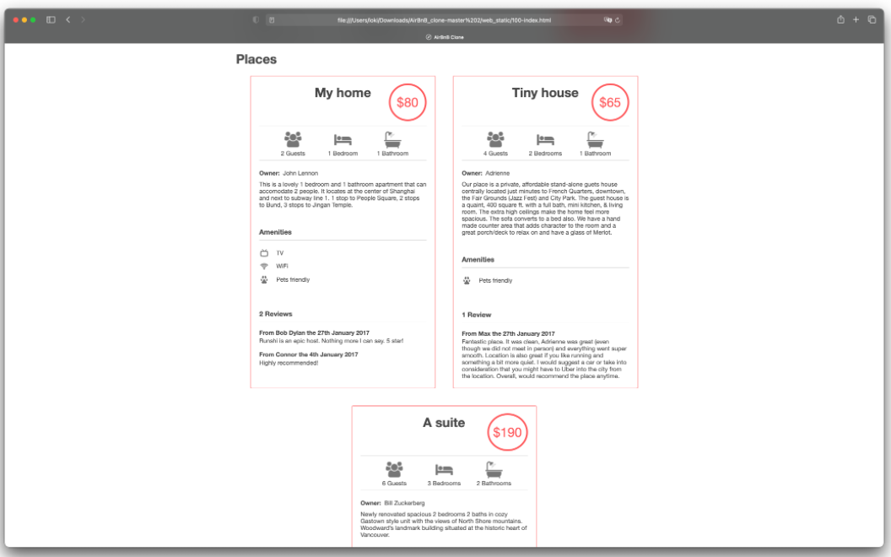
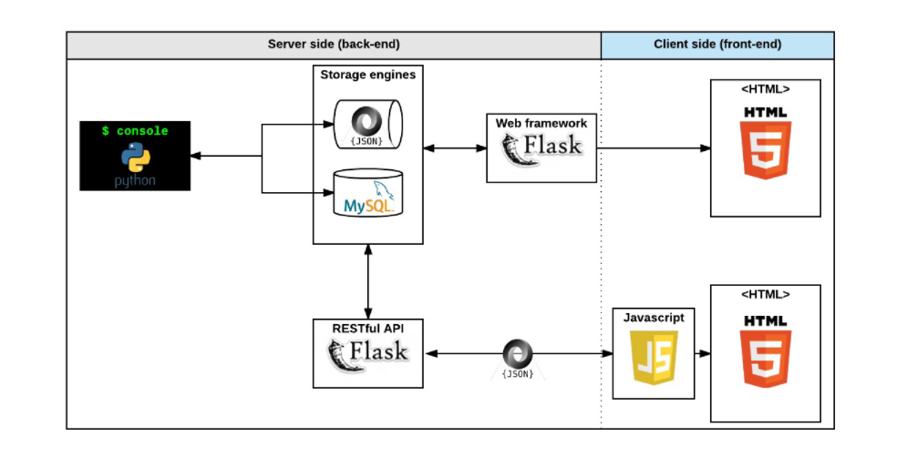

# AirBnB Clone


# AirBnB Clone
**AirBnB** is a *complete web application*, integrating database storage, a back-end API, and front-end interface.
The goal of this project is to deploy on our server a simple copy of the [AirBnB website.](https://www.airbnb.com/)



## The Console - Command interpreter
The Console is the command interpreter that manages our AirBnB objects - Like a shell in Unix-like systems but limited to a specific use case;  in this case, that is managing the objects of this project i.e:
- Create a new object (ex: a new User or a new Place)
- Retrieve an object from a file, a database etc…
- Do operations on objects (count, compute stats, etc…)
- Update attributes of an object
- Destroy an object

## Usage
clone this repository
```
git clone github.com/Surfskills/airbnb_clone.git/AirBnB_clone.git
cd AirBnB_clone
```

#### Starting the Command interpreter
In interactive mode:
**Example**
```
steve@ubuntu:~$ ./console.py
(hbnb) help

Documented commands (type help <topic>):
========================================
EOF  create  help  quit

Undocumented commands:
======================
all  destroy  show  update

(hbnb) help quit
Exit the program
(hbnb) quit
steve@ubuntu:~$
```

In non-interactive mode:
**Example**
```
steve@ubuntu:~$ echo "help" | ./console.py
(hbnb)

Documented commands (type help <topic>):
========================================
EOF  help  quit
(hbnb)
steve@ubuntu:~$
steve@ubuntu:~$ cat test_help
help
steve@ubuntu:~$
steve@ubuntu:~$ cat test_help | ./console.py
(hbnb)

Documented commands (type help <topic>):
========================================
EOF  help  quit
(hbnb)
steve@ubuntu:~$
```
The `console` can `create`, `destroy`, and `update` objects. Type `help` within the console to get a list of command options and its function.

### File Descriptions
This repository contains the following files:

| Folder | File | Description |
| :--- | :--- | :--- |
| tests |  | Contains test files for AirBnb Clone |
|  | console.py | Command line Interpreter for managing AirBnB objects |
| models | base_model.py | Defines all common attributes/methods for other classes |
| models | * | Define all other objects used in this project |
| models/engine | file_storage.py | Implements JSON file storage for the objects |
| models/engine | db_storage.py | Defines methods that interact with mysql database for storing data |
| api | * | Exposes the data in our storage via an API |
| web_framework/* | * | Contains the html, css and javascript files the web interface |
| web_framework | hbnb.py |  Starts a Flask web application for the project |
|  | setup_mysql_dev.sql | sets us the mysql database |
| To be updated |


## To be Implemented..
1. Deploying the app on a server
2. Update README file with a Demo of the web user interface

## Bugs
No Known bugs at this time

## Technologies used
- Languages: python, HTML, CSS, Javascript, sql, Bash
- Frameworks: Flask, flasgger, flask_sqlalchemy, Flask-CORS, JQuery, RESTful API
- Operating system: This project is interpreted/tested on Ubuntu 14.04 LTS using python3
- style: Pycodestyle
- Version control: Git

## Authors
- STEPHEN LUKANU
- FRED OSEGE
